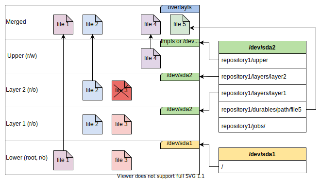

<a id="top"></a>
# Overboot

1. [Overview](#overview)   
  1.1. [Applications](#applications)  
  1.2. [Requirements](#requirements)  
  1.3. [When not to use it](#when-not-to-use-it)  
2. [How it works](#how-it-works)  
	2.1. [Essentials](#essentials)  
	2.2. [Overboot device](#overboot-device)  
	2.3. [Layers](#layers)  
	2.4. [Durables](#durables)  
3. [Configuration](#configuration)  
	3.1. [Rollback](#---)  
	3.2. [Repository](#repository)  
	3.3. [Upper layer](#upper-layer)  
	3.4. [Adding durables](#adding-durables)  
	3.5. [Safe mode](#safe-mode)  
	3.6. [Example configuration](#example-configuration)  
4. [Management](#management)  
5. [Testing with QEMU](#testing-with-qemu)  
6. [Installation](#installation)  
   6.1. [Debian/Ubuntu packages](#debianubuntu-packages)  
   6.2. [Manual build](#manual-build)
7. [TODO](#todo)

## Overview

The Overboot project uses manageable read-only layers to compose the system image at boot time. The general concept can be compared to Docker, but run earlier and on a system-wide basis.

The two main components are `obinit`, written in C and run at boot time, and the extensible C++ `obctl` application (utilizing [cppps](https://github.com/chodak166/cppps)) that provides administration tools (CLI, API, management panel, etc.).

[Back to top](#top)

### Applications

Although the first script originated in 2018 as part of an update management and power loss protection system for ARM boards with embedded Linux, it also finds other applications. Current and potential applications may include:

- creating, testing, and distributing update packages,
- creating and managing system snapshots without using virtual machines,
- protecting the root partition from unwanted changes and damage,
- speeding up services and applications running in the user space,
- reducing the number of write cycles in flash drives,
- versioning changes across the system,
- quick rollback of changes or updates,
- quick and easy device role switching,
- debugging,
- practice systems for students and trainers.

[Back to top](#top)

### Requirements

Currently, the `obinit` binary runs in the early userspace within `initramfs` and uses [OverlayFS](https://docs.kernel.org/filesystems/overlayfs.html). So a boot system using `initramfs` and kernel 3.18 or later is required. The amount of RAM required depends on your configuration. Many variants have been tested on PCs, Raspberry Pi (3 and 4), Up2, and similar boards.

[Back to top](#top)

### When not to use it

Whenever Docker can be used instead of Overboot, use Docker. 

If you need a layered file system to use after the system is already running, just use OverlayFS. This is essentially the OverlayFS toolkit for the operating system, so to use it at the user level would be a little overkill.

[Back to top](#top)

## How it works
### Essentials  

The script located in `/usr/share/initramfs-tools/scripts/local-botton/obinit` will be run by the updated `initramfs` image. This script runs the `obinit` binary, which will mount the overboot repository. It will then glue together the read-only layers in the correct order along with the mutable upper layer and mount it in `/root`, ultimately running as `/`. Take a look at the diagram below, illustrating an example of using an overboot device from the `/dev/sda2` partition over the root file system from `/dev/sda1`. The individual components are discussed in the following sections.



Any change made to files or directories that have not been marked as durable (see below) will be written to the upper layer, leaving the system layer and all intermediate layers untouched. See the OverlayFS documentation to learn more.


[Back to top](#top)

### Overboot device  

Layers, jobs, durables, etc. are stored in the repository on the overboot device. The overboot device is usually a separate `ext4` partition mounted as `/obmnt` in the early user space. Individual resources can be bundled into the final system according to the configuration.

Since version 0.1.3, obinit also offers to mount partition images (formatted `.img` files) or regular directories. This feature arose from the need to upgrade many old systems deployed many years earlier and where repartitioning was not possible. In this scenario, a directory or a file is created, such as `/var/obdev.img`, which is located on the root partition (often the only one available). As a result, the main filesystem is not mounted in read-only mode but is still protected by the upper layer. Another unpleasant consequence is that the principle of immutability of the lower OverlayFS layers is violated. To get around this, user-level access to the image is obstructed by binning the blank. Bottom line: use a separate partition if possible.

[Back to top](#top)

### Layers

In the simplest case, you run Overboot over the read-only root partition, which will be a lower layer with an upper layer that will write all changes to the overboot device or use `tmpfs` to differentially write to the RAM and discard all changes upon reboot.

Nevertheless, you can commit changes as separate layers and stick any layer chain between the system (root) layer and the upper layer. In fact, you can also skip the system layer altogether if your update in any newer layer overrides it.

Each commit will add a layer pointing to the layer previously used as "head". You can use any layer in the chain as "head", fork subsequent commits, and switch between layers. It is then recommended to use `tmpfs` or a clean upper layer when switching between different layers.

[Back to top](#top)

### Durables

If you use RAM as a writable layer (`tmpfs`), the data will not survive the reboot. If you use a persistent upper layer, frequent commits of large files will quickly clog up your repository.

Overboot can bind any resource from the overboot device as a specific path on the system. These are called durables and can be either files or directories. You can think of it as docker volumes, except that they lead to copies of the files in the repository, instead of the original files in the host system. See the configuration section for more details.

[Back to top](#top)

## Configuration 

The main configuration file is `/etc/overboot.yaml`. Additional files can be enabled from the specified directory, the default location is `/etc/overboot.d`.

Editing the configuration file by hand or including configuration modules only makes sense when the overboot is disabled. Remember that making any edits to the file with overboot enabled **will not affect the original file**.

To avoid confusion and make it easy to change the configuration, use the corresponding tools. In the current version, it is recommended to use the `obhelper` helper script. Simply run:

```
obhelper config
```
to edit the configuration file. If Overboot is disabled, it will edit the original file. Otherwise, the new version of the file will be placed in the repository and moved to the root file system during the next boot.

[Back to top](#top)

### Repository 

A repository is a directory on an overboot device. You can change the roles/configurations/snaps of the device just by changing layers, but you will still be left with the same durables and persistent upper layer. To benefit from isolated roles, create different repositories.

[Back to top](#top)

### Head and upper layer  

The layers configuration section may look as follows:

```
layers:
  visible: true
  device: "UUID=04349192-f5bc-48b8-b63b-dd1b8bef0df5"
  repository: "overboot"
  head: "root"
```

where:

**visible** - whether layers should be bound to `/overboot/layers` so that they can be seen by the user;

**device** - the device containing overboot repository (a descriptor in /dev, directory path, image file path, or UUID of the partition formatted as "UUID=<uuid>");
  
**repository** - the name of the repository
  
**head** - the name of the topmost read-only layer (just below the upper layer), "root" (default) for the root filesystem or "none" to skip mounting lower layers. 

The upper layer is configured in a separate section, for the persistent mode it's simply:

```
upper:
  type: "persistent"
```

Jeśli wszystkie operacje zapisu (wyłączając durables) mają być wykonywane w pamięci RAM i utracone po reboocie, wtedy użyj:

```
upper:
  type: "tmpfs"
  size: "50%"
  include_persistent_upper: false
```

Where:

**type** - the type of upper layer ("persistent" or "tmpfs", the latter by default),

**size** - the size of the `tmpfs` file system, may have a `k`, `m`, or `g` suffix for `Ki`, `Mi`, `Gi` or `%` for percentage of available RAM (`50%` by default),

**include_persistent_upper** - whether to use the previously created persistent upper layer as an additional layer above the `head`. This can be helpful when you make changes to the system without committing them, and later want to mount everything in read-only mode.


[Back to top](#top)

### Adding durables

Here's a sample list of persistent resources in the configuration file:

```
durables:
  - path: "/var/log"
    default_type: "directory"
    copy_origin: false
  - path: "/etc/systemd/system/multi-user.target.wants"
    default_type: "directory"
    copy_origin: true
  - path: "/var/myapp/database.sqlite"
    default_type: "file"
    copy_origin: true
```

where:

**path** - the path to which the resource will be bound and (optionally) copied from;

**default_type** - default_type - the type of the resource if it is to be created (when it does not exist in the root filesystem);

**copy_origin** - whether to copy the contents of the original resource (if there is one).

In the example above, after activating Obverboot, the `/var/log` directory will initially be empty, but its contents will persist between reboots and regardless of the type of the upper layer. As for the `multi-user.target.wants` directory, though, it will be copied to the overboot device and will contain copies of the contents from the root filesystem. The same with the database file specified.

Tip: tread carefully with **network configuration** files! It is common practice to add the `/etc/netplan` directory as durable, for example, which keeps the network settings between layers but may restore the settings from the root filesystem when the overboot is disabled.


[Back to top](#top)

### Safe mode

The `obinit` binary will perform a rollback of all changes made at boot time if at least one error occurs. However, you can force closure of `obinit` already at boot if the previous boot failed and the configuration file has not changed since then. This can help avoid boot loops, especially when performing remote updates. To enable this feature use `safe_mode: true` in the top level of the configuration file.

[Back to top](#top)

## Management

Since the `obctl` part of the project is in a very early stage of development, a simple `obhelper` script is offered as a replacement. The `obhelper` script is distributed together with `obinit`, and its basic capabilities are:

- status monitoring,
- editing the config file regardless of the operating mode (see the configuration section),
- creating a new layer from the persistent upper layer using a simple CLI wizard,
- listing available layers,
- quick switching of the layer currently used as `head` layer,
- viewing `obinit` logs,
- creating an overboot device image file and expanding it,
- simple management of jobs scheduled for execution,
- a few minor, helper functions.

Until `obctl` is released, the remaining operations can be performed manually (deleting layers, locating files, or even merging). You can use the bindings in the `/overboot` directory for this, or simply mount the overboot device like any other device and edit the repository. 

As for creating and distributing update packages from layers, you can try to simply archive the layer directory (files and metadata) and upload them to a remote repository. This approach, however, can be tricky with certain file types, so the recommended method is to save the layer contents in a formatted `.img` file and compress it before uploading. Some more convenient and smarter mechanism should be available as the project develops.

[Back to top](#top)

## Testing with QEMU 

In the `tests/scripts` directory, there are helper scripts for automatically building QEMU virtual machines and a script that installs `obinit` on such a machine. The script called `qemu-run-obinit.sh` should do everything for you. Although these are developer tools, perhaps they will make it easier for you to play around before you try Overboot on your system or on, say, VirtualBox.

[Back to top](#top)

## Installation

The recommended installation approach is to use packages for your distribution, as they will run the appropriate scripts and commands in addition to copying the files. Details can be found below and on the latest release page.

### Debian/Ubuntu packages

Ubuntu builds are available to install via the PPA:

```bash
sudo add-apt-repository ppa:chodak166/ppa
sudo apt-get update
sudo apt-get install overboot-obinit
```

[Back to top](#top)

### Manual build

To build and install just run:

```
mkdir build && cd build
cmake ..
cmake --build .
```

and then:
```
sudo make install
```
to place all the files in the right directories. Create the `initrd.img` by running:

```
update-initramfs -c -k $(uname -r)
```

Also, make sure that there are `overlay` and `loop` modules enabled in `/etc/modules` file.

#### Raspbian/RaspiOS notes

While using Overboot with Raspberry Pi and Debian-based distros, one should enable `initramfs` by adding the `INITRD=Yes` entry in `/etc/default/raspberrypi-kernel` file.

The `/boot/config.txt` file should then have an entry such as `initramfs initrd.img-<your version here>`. To update this file automatically after running `update-initramfs`, a hook in `/etc/initramfs-tools/hooks` can be added. A simple one may look like this:

```
#!/bin/bash

echo "Updating /boot/config.txt"

if grep -q 'initramfs ' /boot/config.txt; then
  sed -i "s|^initramfs .*|initramfs initrd.img-\$(uname -r)|" /boot/config.txt
else
  echo -e "\ninitramfs initrd.img-\$(uname -r)" >> /boot/config.txt
fi
```

Investigate the `obinit/apps/obinit/deb/postinst` script to learn how the package is dealing with it.

[Back to top](#top)

## TODO

Things to do mainly concern the `obctl` part. See the TODO file in the corresponding directory. Any support and help will be appreciated.
